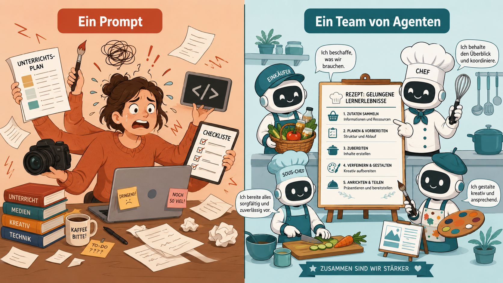
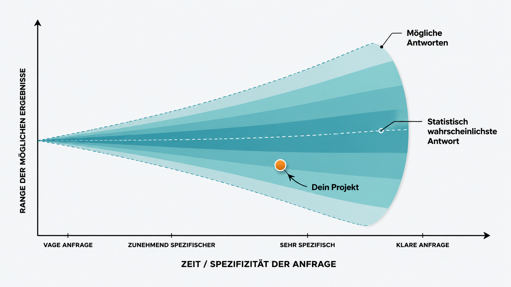
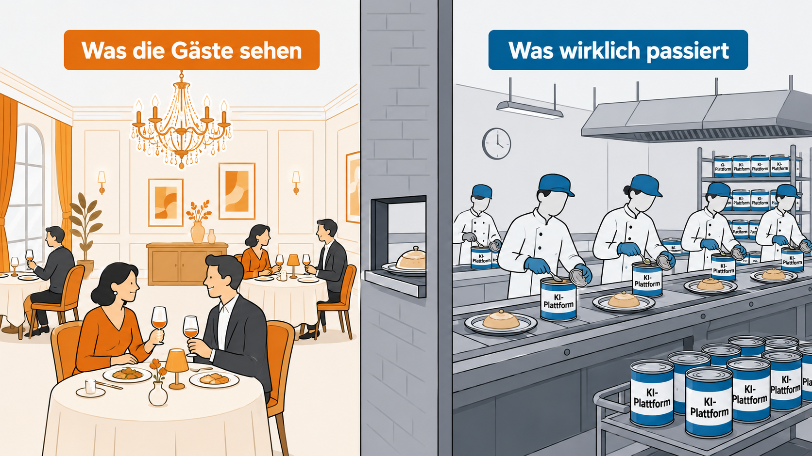
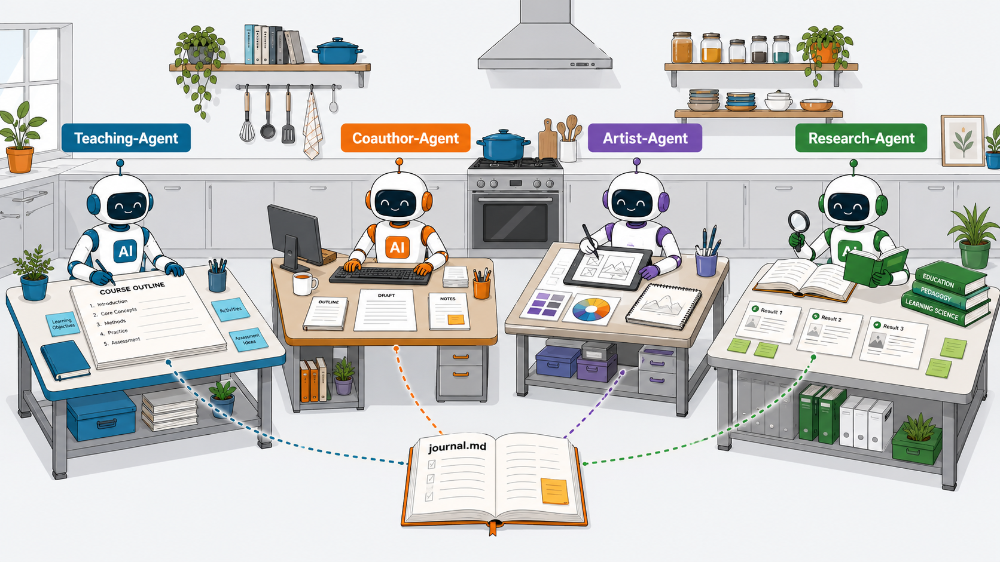
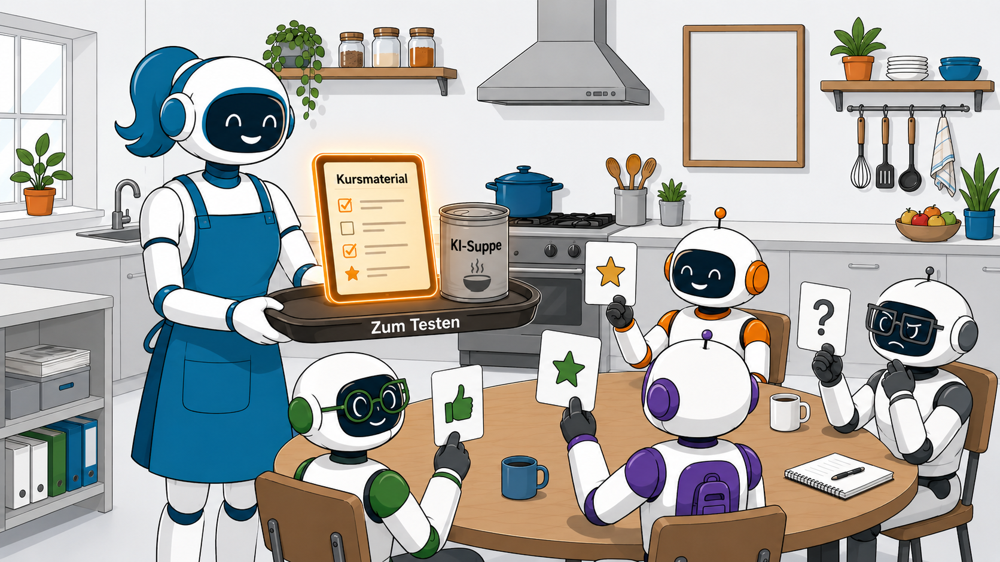

<!--
author:   André Dietrich
email:    LiaScript@web.de
version:  0.1.0
edit:     true
language: de
narrator: Deutsch Male

comment:  Ein Prompt ist kein Team — Warum KI-Agenten für komplexe Lehrprojekte nötig sind. Vortrag beim University:Future Festival 2026.

import: https://raw.githubusercontent.com/liaScript/mermaid_template/master/README.md
import: https://raw.githubusercontent.com/LiaTemplates/Chat-Simulation/main/README.md
-->

# Ein Prompt ist kein Team

Warum KI-Agenten für komplexe Lehrprojekte nötig sind
-----------------------------------------------------



    {{1}}
> University:Future Festival 2026
>
> -- André Dietrich · TU Bergakademie Freiberg · LiaScript

    {{2}}
* GitHub: https://github.com/andre-dietrich/Ein-Prompt-ist-kein-Team
* Editor: https://liascript.github.io/LiveEditor/?/show/file/https://raw.githubusercontent.com/andre-dietrich/Ein-Prompt-ist-kein-Team/refs/heads/main/README.md
* LiaScript: https://liascript.github.io/course/?https://raw.githubusercontent.com/andre-dietrich/Ein-Prompt-ist-kein-Team/refs/heads/main/README.md


## Das generische Ergebnis-Dilemma

    {{0}}
> Du öffnest ChatGPT. Gibst deinen besten Prompt ein.
> 
> Und ärgerst dich über das Ergebnis.

    {{1}}
<!-- data-show data-ylim="0,100"-->
| Reaktion            |   Stimmen |
|---------------------|----------:|
| {3}{Zufrieden 🥳}   |  {3}{1 %} |
| {2}{Neutral 😐}     | {2}{20 %} |
| {3}{Unzufrieden 🙁} | {3}{79 %} |

    {{4}}



### KI als Ein-/Ausgabe-Maschine

Wir behandeln KI wie ein Programm: eine Eingabe, eine Ausgabe, fertig.

      {{1}}
```ascii
  +------+   Prompt   +------+   Ausgabe   +----------+
  |  Du  | ---------> |  KI  | ----------> | Ärgernis |
  +------+            +------+             +----------+
```

      {{2}}
Aber Conversational AI braucht **Dialog** —
sie muss sich auf dich einschwingen,
auf dein Projekt, deinen Kontext, deine Lernenden.

{{3}} __Quelle:__ https://liascript.github.io/blog/creating-interactive-diagrams-with-chatgpt/

      {{3}}
``` html -Visualization-Template
The following LiaScript code generates an interactive chart on different types
of quadratic functions, where the user can manipulate certain parameters.
Rewrite this to draw another [ visualization ] and change the number of input
parameters, if required. Mark this prompt as "UNDERSTOOD" when you are ready.

$a =$ <script modify="false" input="range" step="1"   min="-1"  max="6"  value="2" output="a">@input</script>,
$b =$ <script modify="false" input="range" step="0.1" min="-10" max="10" value="0" output="b">@input</script>,
$c =$ <script modify="false" input="range" step="0.1" min="-10" max="10" value="0" output="c">@input</script>

<script modify="false" run-once style="display: inline-block; width: 100%">
"LIASCRIPT: ### $$f(x) = x^{@input(`a`)} + x * @input(`b`) + @input(`c`)$$"
</script>

<script run-once style="display: inline-block; width: 100%">
function func(x) {
  return Math.pow(x,  @input(`a`)) + @input(`b`) * x + @input(`c`);
}

function generateData() {
  let data = [];
  for (let i = -15; i <= 15; i += 0.01) {
    data.push([i, func(i)]);
  }
  return data;
}

let option = {
  grid: { top: 40, left: 50, right: 40, bottom: 50 },
  xAxis: {
    name: 'x',
    minorTick: { show: true },
    splitLine: { lineStyle: { color: '#999' } },
    minorSplitLine: { show: true, lineStyle: { color: '#ddd' } }
  },
  yAxis: {
    name: 'y', min: -10, max: 10,
    minorTick: { show: true },
    splitLine: { lineStyle: { color: '#999' } },
    minorSplitLine: { show: true, lineStyle: { color: '#ddd' } }
  },
  series: [
    {
      type: 'line',
      showSymbol: false,
      data: generateData()
    }
  ]
};

"HTML: <lia-chart option='" + JSON.stringify(option) + "'></lia-chart>"
</script>
```


### Die Dosensuppe

    {{1}}


    {{2}}
Das Restaurant sieht toll aus.\
Aber zu essen bekommt jede\*r **das Gleiche aus der Dose**.

    {{3}}
> _Die Komplexität verschwindet aus der Oberfläche, nicht aus dem Problem._

    {{4}}
<details>

<summary>Wer mir nicht glaubt ...</summary>

!?[38C3 - Chatbots im Schulunterricht!?](https://www.youtube.com/watch?v=o6DBGdnA1P4)

</details>

## Was wir eigentlich brauchen

    {{1}}


### Die Küchenbrigade

    {{1}}


    {{2}}
> Das entscheidende Prinzip: Kontext wird nicht jedes Mal neu geprompted — er wird als Artefakt definiert und von allen Agenten geteilt.

### Agenten, Tasks & Artefakte

      {{1}}


### Superpower -> Vorkoster

      {{1}}


      {{2}}
> Du kannst Agenten bauen, die deine **Lernenden verkörpern** — mit ihrem Vorwissen, ihren Erwartungen, ihren typischen Stolperstellen.

### Rezepte statt Prompts

      {{1}}
| Prompt                     | Workflow                   |
|----------------------------|----------------------------|
| einmalig                   | wiederholbar               |
| vergessen nach der Session | versioniert in Git         |
| Blackbox                   | lesbar, anpassbar, teilbar |
| Dosensuppe                 | dein Rezept                |

## Demo Or Die

     {{1}}
* **Setup:**

  - __VS Code Editor:__ https://code.visualstudio.com
  - __"Desktop" Agents:__
    1. GitHub Copilot (Kostenloser Teacher-Account)\
       https://docs.github.com/en/education/about-github-education/github-education-for-teachers/apply-to-github-education-as-a-teacher

    2. Codex (by ChatGPT)\
       https://openai.com/de-DE/codex/

    3. Claude Code\
       https://code.claude.com

    4. ...

    99. *und viele Weitere ...*

    {{2}}
* **Teaching-Agent:**

  https://github.com/LiaScript/teaching-agent

    {{3}}
* **Original BMAD-Method:**

  https://github.com/bmad-code-org/BMAD-METHOD

    {{4}}
* **Vorlesung: Databases Unlocked**

  - GitHub: https://github.com/andre-dietrich/Datenbankensysteme-Vorlesung
  - WebSeite: https://andre-dietrich.github.io/Datenbankensysteme-Vorlesung/

## Danke & Links


- 🌐 **LiaScript:** https://liascript.github.io
- 🤖 **Teaching-Agent:** https://github.com/LiaScript/teaching-agent
- 💬 **Chat-Simulation Template:** https://github.com/LiaTemplates/Chat-Simulation
- 🎓 **University:Future Festival:** https://festival.hfd.digital

      {{1}}
> Fragen? Ideen? Ich bin nach dem Vortrag noch da.
>
> -- André Dietrich · LiaScript@web.de


