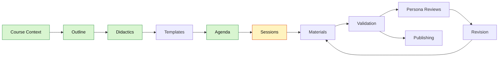

<!--
color: <span style="display:inline-block;width:1.5rem;height:1.5rem;background-color:@0;border:1px solid #ccc;border-radius:2px;vertical-align:middle;"></span> `@0`

import: https://raw.githubusercontent.com/liaScript/mermaid_template/master/README.md
import: https://raw.githubusercontent.com/LiaTemplates/Chat-Simulation/main/README.md

@style
.dashboard {
  margin: 1.5rem 0 2rem;
  padding: 1rem;
  border: 1px solid #d7e0ea;
  border-radius: 8px;
  background: #f8fafc;
}

.dashboard-grid {
  display: flex;
  flex-wrap: wrap;
  gap: 1rem;
}

.dashboard-card {
  flex: 1 1 260px;
  min-width: 240px;
  padding: 1rem;
  border: 1px solid #d7e0ea;
  border-radius: 8px;
  background: #ffffff;
}

.dashboard-card-wide {
  flex-basis: 100%;
}

.dashboard-status {
  display: inline-block;
  padding: 0.18rem 0.5rem;
  border-radius: 999px;
  font-weight: 700;
}

.dashboard-status-done { background: #d8f5d0; color: #1b5e20; }
.dashboard-status-current { background: #fff3bf; color: #7a4d00; }
.dashboard-status-blocked { background: #ffe3e3; color: #8a1f1f; }

.dashboard table {
  width: 100%;
  border-collapse: collapse;
}

.dashboard th,
.dashboard td {
  padding: 0.35rem 0.45rem;
  border-bottom: 1px solid #e5edf5;
  text-align: left;
}

@media (max-width: 600px) {
  .dashboard-card {
    flex-basis: 100%;
    min-width: 0;
  }
}
@end
-->

# Ein Prompt ist kein Team — Warum KI-Agenten für komplexe Lehrprojekte nötig sind

## Dashboard

<article class="dashboard">

_Generated from the project sections below. Do not edit manually._

<div class="dashboard-grid">

<div class="dashboard-card">

### Current State

__Current step:__ <span class="dashboard-status dashboard-status-current">Session-Skeleton erstellt — nächster Schritt: `:coauthor-materials`</span>

__Course validation:__ <span class="dashboard-status dashboard-status-blocked">not run</span>

__Sessions complete:__ 0 / 1

__Last updated:__ 2026-06-21 (Visual Identity + Bilder)

</div>

<div class="dashboard-card">

### Next Commands

1. `:create-session 1 lesson`
2. `:coauthor-materials`
3. `:validate-course 1 lesson`

</div>

<div class="dashboard-card">

### Quality State

<!-- data-type="none" -->
| Area | State |
| --- | --- |
| Course context | <span class="dashboard-status dashboard-status-done">done</span> |
| Outline | <span class="dashboard-status dashboard-status-done">done</span> |
| Didactics | <span class="dashboard-status dashboard-status-done">done</span> |
| Agenda | <span class="dashboard-status dashboard-status-done">done</span> |
| Templates | <span class="dashboard-status dashboard-status-done">1 aktiv (Chat-Simulation)</span> |
| Visual identity | <span class="dashboard-status dashboard-status-done">done — 6 Bilder generiert</span> |
| Materials | <span class="dashboard-status dashboard-status-blocked">0 / 0</span> |
| Course validation | <span class="dashboard-status dashboard-status-blocked">not run</span> |
| Persona reviews | <span class="dashboard-status dashboard-status-current">optional</span> |

</div>

<div class="dashboard-card dashboard-card-wide">

### Workflow Map



</div>

<div class="dashboard-card dashboard-card-wide">

### Session Progress

| # | Title | Skeleton | Material | Done |
|---|-------|----------|----------|------|
| 1 | Ein Prompt ist kein Team | ✅ | ❌ | ❌ |

</div>

<div class="dashboard-card">

### Open Blockers

Material fehlt — führe `:coauthor-materials` aus.

</div>

<div class="dashboard-card">

### Quick Links

[Course Context](#course-context) · [Outline](#outline) · [Didactics](#didactics) · [Templates](#templates) · [Agenda](#agenda) · [Sessions](#sessions) · [Validation](#validation)

</div>

</div>
</article>

---

## Course Context

* __Course Type:__
  1. Type: single-lesson
  2. Working Title: Ein Prompt ist kein Team — Warum KI-Agenten für komplexe Lehrprojekte nötig sind

* __Terminology:__
  1. sessions-called: lesson
  2. lectures-called: lesson

* __Course Profile:__
  1. Persona type: tutor
  2. Agenda required: yes
  3. Pacing: n/a
  4. Assessment defaults: optional quiz

* __Conventions & Standards:__
  1. Language: de
  2. Tone: informell
  3. Person: Du
  4. Accessibility: optional

* __LiaScript conventions:__
  - Gliederungstiefe max. 3 Ebenen: `#` Titel, `##` Section, `###` SubSection
  - `####` nur für Animationen erlaubt (kein weiteres Nesting)

* __Additional Notes:__
  - Vortrag: 30 Minuten Länge

---

## Outline

* __Title:__
  Ein Prompt ist kein Team — Warum KI-Agenten für komplexe Lehrprojekte nötig sind

* __Target Audience:__
  Lehrende, Didaktiker*innen und digitalinteressierte Hochschulmitarbeiter*innen. Vorwissen: Grunderfahrung mit LLM-Tools (ChatGPT, Copilot o.ä.), kein Programmierhintergrund nötig. Erwartung: praktische Orientierung, was KI-Agenten für Lehrprojekte leisten können und was nicht. Kontext: University:Future Festival (gemischtes Hochschulpublikum, ~4.800 Teilnehmende).

* __Abstract:__
  Seit der Verbreitung generativer KI in der Hochschullehre dominieren prompt-basierte Werkzeuge: Ein Textfeld, eine Eingabe, ein Ergebnis. Für einfache Aufgaben ist das hilfreich – bei komplexen Lehrprojekten stößt dieser Ansatz jedoch schnell an Grenzen. Dennoch setzen viele kommerzielle Plattformen genau hier an: Sie verstecken Prompts hinter grafischen Oberflächen und versprechen Planung per Klick, während im Hintergrund meist dieselben großen Sprachmodelle arbeiten. Die Komplexität verschwindet aus der Oberfläche, nicht aus dem Problem.

  Dieser Vortrag stellt diesem Ansatz ein anderes Denkmodell gegenüber. In einer Live-Vorführung wird gezeigt, wie KI-Agenten mit klaren Rollen, Spezifikationen und Arbeitsabläufen zusammenarbeiten können – angelehnt an Methoden aus der Softwareentwicklung. Statt Prompts zu optimieren, entstehen strukturierte Prozesse, nachvollziehbare Artefakte und wiederverwendbare Agenten. Die Teilnehmenden sehen, wie eigene KI-Agenten erstellt, angepasst und als Community-Ressourcen geteilt werden können – für mehr Kontrolle, Transparenz und Gestaltungsspielraum bei komplexen Lehrprojekten. Dazu gehört die Live-Demonstration des aktuellen Entwicklungs-Workflows.

* __Learning Objectives:__
  1. Die Teilnehmenden können erklären, warum Einzelprompts bei komplexen Lehrprojekten strukturell an Grenzen stoßen.
  2. Die Teilnehmenden kennen das Konzept von KI-Agenten mit Rollen, Spezifikationen und Workflows und können es vom Prompting abgrenzen.
  3. Die Teilnehmenden haben einen Live-Workflow gesehen und können einschätzen, welche Schritte in eigenen Projekten übertragbar sind.
  4. Die Teilnehmenden wissen, wie eigene Agenten erstellt, angepasst und als Community-Ressourcen geteilt werden können.

---

## Didactics

* __Didactic Concept:__
  Problem-first Einzelbogen für einen 30-minütigen Konferenzvortrag: Einstieg mit provokanter These ("Ein Prompt ist kein Team") und einem konkreten Beispiel für das Scheitern des Einzelprompts. Konzeptueller Schwenk: KI-Agenten mit Rollen, Spezifikationen und Workflows als Gegenmodell — angelehnt an Softwareentwicklungsmethoden. Kernstück: Live-Demonstration des Teaching-Agent-Workflows. Abschluss: Übertragbarkeit, Community-Sharing, offene Fragen. Kein Gruppenformat, keine Breakouts — fokussierte Einzelpräsentation.

* __Professor Persona:__
  André Dietrich, Ersteller von LiaScript und Forscher an der TU Bergakademie Freiberg. Kombiniert technische Tiefe (Softwareentwicklung, Sprachdesign) mit pädagogischer Perspektive und langjähriger Open-Source-Erfahrung. Spricht aus eigener Praxis: hat das im Vortrag gezeigte Agenten-System selbst entwickelt und erprobt.

* __Teaching Style:__
  Gemischt: praktisch + konversational. Demo-getrieben, aber mit direkter Publikumsansprache, persönlichen Kommentierungen und ehrlichen Einschränkungen. Kein akademisches Distanzhalten, aber auch kein reiner Entertainer-Modus. Der Stil zeigt sich im Material durch aktive Du-Ansprache, kurze erklärende Einschübe und sichtbare Arbeit am lebenden Objekt.

* __Course Type:__
  Einführungsvortrag, praxisorientiert, Einzelpersonen-Präsentation mit Live-Demonstration.

* __Difficulty Level:__
  beginner — Grunderfahrung mit LLM-Tools (ChatGPT, Copilot o.ä.) wird vorausgesetzt; Agenten-Konzept wird neu eingeführt; kein Programmierhintergrund nötig.

* __Persona Voice Sample:__
  "Stell dir vor, du bittest eine einzige Person, gleichzeitig dein Lehrkonzept zu schreiben, die Aufgaben zu formulieren, Bilder zu generieren und das Ganze in LiaScript zu formatieren. Irgendwas wird schief gehen — nicht weil die Person unfähig ist, sondern weil das keine sinnvolle Aufgabenverteilung ist. Genau das passiert, wenn wir komplexe Lehrprojekte mit einem einzigen Prompt angehen. Was ich dir zeigen möchte, ist kein Trick und kein Plugin — es ist ein anderes Denkmodell: Rollen, Verantwortlichkeiten, Workflows. Das kennen wir aus der Softwareentwicklung, und es funktioniert genauso gut für Bildung."

---

## Visual Identity

_Style Guide — abgeleitet aus den bereits produzierten Vortragsgrafiken (`assets/images/`), damit Dokumentation und vorhandene Assets übereinstimmen. Persona: technisch fundiert + konversational, Open-Source-Haltung, Du-Ansprache, beginner-freundlich. Leitmetapher: Küche / Küchenbrigade._

* __Logo Generation Guidelines:__
  1. Style: modern, flat-editorial, freundlich-zugänglich (nicht akademisch-steif, nicht verspielt-cartoonhaft)
  2. Format: flat design mit leichter Tiefe, gleichmäßige Linienstärke, vektorartig und skalierbar
  3. Elements: Küchen-/Brigade-Motiv (Kochmütze, Topf, Rezeptbuch) kombiniert mit einem Agenten-/Workflow-Hinweis (mehrere kleine Figuren, geteilter Knotenpunkt); Anspielung auf `journal.md` als gemeinsames Rezeptbuch
  4. Mood: kompetent, einladend, kollaborativ — „mehrere Rollen, eine geteilte Quelle"

* __Default Logo Prompt Base:__
  "A modern flat-editorial logo for a talk about AI agents in education, friendly and approachable, featuring a stylized chef's brigade / shared recipe book motif, teal and amber color accents, clean lines, subtle depth, scalable for slides and print."

* __Logo Color Palette:__
  1. Primary: @color(#1A7FAB) — Teal (Leitfarbe, Teaching-Agent / Marke)
  2. Secondary: @color(#7B4FAB) — Lila (Artist-Agent / unterstützende Akzente)
  3. Accent: @color(#E87C2B) — Amber (Highlights, warmes „Kursmaterial"-Leuchten, Call-to-Action)
  4. Background: @color(#F4F6F8) — helles Grau (Leinwand)

* __Color Usage:__
  - Primary (Teal): Hauptelemente, Überschriften, Marken-Anker
  - Secondary (Lila): unterstützende Elemente, zweite Agenten-Rolle
  - Accent (Amber): Highlights, Hervorhebungen, wichtige Aussagen
  - Background: Leinwand und Bildhintergründe
  - Weitere Agentenfarbe: @color(#2B8A3E) — Grün (Research-Agent / positive Bewertung „Daumen hoch")

* __Course Image Generation Guidelines:__
  1. Visual style: flache, redaktionelle Illustration (flat editorial), kein Fotorealismus, leichte Tiefe
  2. Color scheme: Teal/Lila/Amber/Grün auf hellgrauem Hintergrund (@color(#F4F6F8)); warme Töne für „menschlich/eigenes Kochen", kühle/entsättigte Töne für „generisch/Dosensuppe"
  3. Composition: klar gegliedert, oft Split-View-Kontrast (links vs. rechts); 16:9 querformat, foliengerecht
  4. Lighting: weich und gleichmäßig, freundlich
  5. Mood: einladend, leicht spielerisch, kompetent — passend zur Du-Ansprache
  6. In-image text language: Deutsch (alle Beschriftungen, Labels, Überschriften im Bild)

* __Default Image Prompt Base:__
  "Modern flat editorial vector illustration, 16:9, 1920x1080px, kitchen/brigade metaphor, friendly and approachable AI-agent characters, palette teal #1A7FAB / purple #7B4FAB / amber #E87C2B / green #2B8A3E on a light grey #F4F6F8 background, soft flat shading, consistent line weight, no photorealism. All visible text in German."

* __Image Specifications:__
  - Aspect ratio: 16:9 (Folienformat)
  - Resolution: 1920×1080 px
  - Format: PNG
  - Accessibility: jedes Bild mit aussagekräftigem deutschen Alt-Text (siehe `## Sessions` → `#### Images`)

* __Image Consistency Rules:__
  1. Color palette: durchgängig Teal/Lila/Amber/Grün auf @color(#F4F6F8) — gleiche Agenten-Farbe pro Rolle
  2. Style: durchgängig flat-editorial, kein Stilbruch (kein Fotorealismus, keine 3D-Renderings)
  3. Characters: Agenten als freundliche, gender-neutrale, robotisch-stilisierte Figuren; pro Rolle gleiche Farbe/Erkennungsmerkmal; Lernenden-Roboter kleiner als die Brigade-Agenten
  4. Icons: konsistenter Stil, gleiche Linienstärke wie in den Illustrationen
  5. Typography in images: serifenlose, fette Beschriftungen, Deutsch
  6. Spacing: ruhige, aufgeräumte Komposition, klarer Negativraum
  7. Background: einheitlich helles Grau @color(#F4F6F8), kein verlaufslastiger Hintergrund

* __Website Color Palette:__
  1. Primary: @color(#1A7FAB) — Teal: Überschriften, Section-Header, primäre UI-Elemente
  2. Accent: @color(#E87C2B) — Amber: Highlights, Call-to-Action, wichtige Aussagen
  3. Text: @color(#1F2933) — dunkles Schiefergrau: Fließtext
  4. Background: @color(#F4F6F8) — helles Grau: Seitenhintergrund
  5. Surface: @color(#FFFFFF) — Weiß: Inhaltsboxen, Karten

* __Typography:__
  - Headings: serifenlos, fett (z. B. Inter / system-ui) — empfohlen, an LiaScript-Default anpassbar
  - Body: serifenlos, gut lesbar (z. B. Inter / system-ui)
  - Monospace: JetBrains Mono / Fira Code für Code, Befehle und `journal.md`-Verweise
  - ⚠️ Schriftempfehlung — nicht zwingend; LiaScript-Standardschriften sind ein gültiger Fallback.

* __Example Prompts:__
  1. Logo: "A modern flat-editorial logo, friendly and approachable, a stylized chef's hat merging with four small connected agent dots over an open recipe book labeled 'journal.md', teal #1A7FAB primary with an amber #E87C2B highlight, clean consistent line weight, light grey #F4F6F8 background, scalable vector style. No photorealism."
  2. Course image: "Modern flat editorial vector illustration, 16:9, 1920x1080px. A friendly stylized AI agent in a kitchen handing a shared recipe book to a colleague agent, both in distinct colors (teal #1A7FAB, amber #E87C2B), light grey #F4F6F8 background, soft flat shading, consistent line weight, slightly playful and inviting. German label on the book: 'Rezept'. No photorealism."
  3. Diagram: "Clean minimal flat diagram, 16:9, central open recipe book labeled 'journal.md' connected by dotted lines to four labeled agent icons (Teaching teal #1A7FAB, Coauthor amber #E87C2B, Artist purple #7B4FAB, Research green #2B8A3E) arranged around it, light grey #F4F6F8 background, bold sans-serif German labels, no photorealism."

---

## Templates

_Managed by `:manage-templates` from `templates/course-templates.yaml`._

LiaScript templates used by this project are imported in the main metadata header at the top of `journal.md` and should also be imported in any standalone material file that uses their macros.

More community templates can be found at [topics/liascript-template](https://github.com/topics/liascript-template). When a useful template is selected, add its `import:` line to the project header, document it here, and use the same import in materials that need the template.

### Chat-Simulation

* __Import:__
  `https://raw.githubusercontent.com/LiaTemplates/Chat-Simulation/main/README.md`

* __Header entry:__
  `import: https://raw.githubusercontent.com/LiaTemplates/Chat-Simulation/main/README.md`

* __Purpose:__
  Rendert einen animierten Chat-Verlauf als Slide-Element. Nachrichten erscheinen sequenziell mit Tipp-Animation. Ideal für diesen Vortrag, um reale KI-Dialoge (z.B. Claude-Code-Sessions) nachzustellen und zu demonstrieren.

* __Use when:__
  1. Ein Gespräch mit einem KI-Agenten auf einer Folie visualisiert werden soll.
  2. Die Interaktion zwischen Nutzer und Coauthor-Agent demonstriert werden soll (Live-Demo-Abschnitt).

* __Basic example:__

  ````text
  ``` javascript @CHAT
  [
    {name: "André", message: "Erstell mir ein Outline für den Vortrag."},
    {name: "Teaching-Agent", message: "Gerne! Wer ist deine Zielgruppe?"}
  ]
  ```
  ````

* __Project examples:__

  Beispiel 1 — Outline-Gespräch:

  ``` javascript @CHAT
  [
    {name: "🧑‍💻 André", message: "`:create-outline`"},
    {name: "🎓 Teaching-Agent", message: "Für wen ist dieser Vortrag? Beschreibe die Zielgruppe möglichst konkret — Vorwissen, Kontext, Erwartungen."},
    {name: "🧑‍💻 André", message: "Gemischtes Publikum beim University Future Festival — Lehrende, Didaktiker*innen, keine Entwickler*innen."},
    {name: "🎓 Teaching-Agent", message: "Gut. Ich schlage diese Zielgruppe vor: _Lehrende und Didaktiker*innen mit Grunderfahrung in LLM-Tools, kein Programmierhintergrund nötig._ Passt das?"},
    {name: "🧑‍💻 André", message: "Ja, passt so."}
  ]
  ```

  Beispiel 2 — Didaktik-Diskussion:

  ``` javascript @CHAT
  [
    {name: "🧑‍💻 André", message: "Ich würde gerne die Dosensuppen-Metapher einbauen — kommerzielle Plattformen servieren allen das Gleiche."},
    {name: "🎓 Teaching-Agent", message: "Starke Ergänzung! Die Metaphernlinie zieht sich dann durch den ganzen Vortrag: **Dosensuppe** → kommerzielle Plattformen, **Selbst kochen** → eigene Agenten, **Rezepte teilen** → Community-Sharing. Soll ich die Agenda entsprechend anpassen?"},
    {name: "🧑‍💻 André", message: "Ja, genau so."},
    {name: "🎓 Teaching-Agent", message: "Erledigt — Abschnitt 2 heißt jetzt _Das Problem — Einzelprompts, Dosensuppe und das generische Ergebnis-Dilemma_."}
  ]
  ```

* __How to use:__
  1. Code-Block mit Sprache `javascript` und Annotation `@CHAT` öffnen.
  2. JSON-Array mit `{name, message}`-Objekten eintragen — Markdown in `message` wird gerendert.
  3. Erster Name erscheint links, alle weiteren rechts.

* __Special usage notes:__
  1. Der erste `name`-Eintrag im Array legt die linke Seite fest — konsequent für eine Person nutzen.
  2. `message` unterstützt Markdown (`**fett**`, `_kursiv_`, Code-Inline).
  3. Import muss auch im Header von `materials/1-lesson.md` stehen.

---

## Agenda

* __Overview:__
  Kompakter 30-Minuten-Einzelvortrag in fünf Abschnitten, strukturiert als Problem-first-Bogen. Kein Gruppenformat, keine Breakouts — ein durchgehender Fluss von der provokanten These zur Live-Demo. Durchgängige Metaphernlinie: Dosensuppe (generischer Prompt, kommerzielle Plattformen) → Selbst kochen (Agenten mit Rollen, definierte Artefakte) → Rezepte teilen (Community-Sharing). Plattform: LiaScript-Präsentation im Browser.

* __Key concepts per section:__
  1. Hook setzt die These: ein Prompt ist immer generisch — statistisch das Wahrscheinlichste, nicht das Spezifische.
  2. Problemteil entfaltet drei Argumente: generisches Ergebnis-Dilemma, KI wird falsch als Ein-/Ausgabe-Programm genutzt statt als Conversational AI, kommerzielle Plattformen verstecken Prompts hinter Oberflächen (Dosensuppe).
  3. Gegenmodell erklärt Agentic Workflows: eigene Sous-Chefs, Einkäufer und Kontext als definierte Artefakte — alle Agenten wissen, auf welche Daten sie bei welcher Aufgabe zugreifen.
  4. Live-Demo zeigt den Teaching-Agent-Workflow konkret in Aktion.
  5. Ausblick: Rezepte weitergeben — Workflows als Community-Ressourcen, Übertragbarkeit auf eigene Lehrprojekte.

* __Sections:__

  | # | Titel | Typ | ca. Zeit | Lernziel | Material |
  |---|-------|-----|----------|----------|----------|
  | 1 | Hook: Ein Prompt ist kein Team | Vortrag | 2 min | — | materials/1-lesson.md |
  | 2 | Das Problem — Einzelprompts, Dosensuppe und das generische Ergebnis-Dilemma | Vortrag | 8 min | LZ 1 | materials/1-lesson.md |
  | 3 | Das Gegenmodell — Selbst kochen: Agenten mit Rollen, Spezifikationen & Workflows | Vortrag | 6 min | LZ 2 | materials/1-lesson.md |
  | 4 | Live-Demo — Teaching-Agent-Workflow in Aktion | Demo | 10 min | LZ 3 | materials/1-lesson.md |
  | 5 | Ausblick — Rezepte teilen: Community-Sharing & Übertragbarkeit | Vortrag | 4 min | LZ 4 | materials/1-lesson.md |

---

## Sessions

_Managed by `:create-session`, `:promote-session`, `:coauthor-materials`, `:validate-course`, `:create-image`, and `:generate-image`. Overview table first, then one `### {n}. {title}` subsection per session. Each session may hold a `#### Images` block (image prompts) and a `#### Validation Report`._

| # | Title | Type | Skeleton | Material | Done | Notes |
|---|-------|------|----------|----------|------|-------|
| 1 | Ein Prompt ist kein Team | lesson | ✅ | ❌ | ❌ | 30 min, Live-Demo in Abschnitt 4 |

### 1. Ein Prompt ist kein Team — Warum KI-Agenten für komplexe Lehrprojekte nötig sind

**Type:** lesson

**Summary:**

Der Vortrag ist ein kompakter 30-Minuten-Einzelbogen für das University:Future Festival, gerichtet an Lehrende und Didaktiker*innen ohne Programmierhintergrund. Ausgangspunkt ist eine provokante These: Ein einzelner Prompt liefert immer das statistisch Wahrscheinlichste — nie das, was du für dein spezifisches Lehrprojekt wirklich brauchst. Der Vortrag zeigt, warum kommerzielle KI-Plattformen dieses Problem eher verstecken als lösen (Dosensuppe-Metapher), und stellt ein alternatives Denkmodell vor: eigene Agenten mit Rollen, Spezifikationen und gemeinsam genutzten Artefakten — wie eine selbst zusammengestellte Küchenbrigade mit teilbaren Rezepten. Kernstück ist eine Live-Demonstration des Teaching-Agent-Workflows. Bekannte Risikostelle: die Demo (Abschnitt 4) — Plan B für technische Ausfälle vorbereiten.

**Content:**

_Abschnitt 1 — Hook (ca. 2 min)_

- These einführen: „Ein Prompt ist kein Team"
- Eröffnung mit konkretem Fehlbeispiel oder Frage ans Publikum: „Wer hat sich schon mal über ein KI-Ergebnis geärgert?"
- Kurzankündigung des Vortragsbogens

_Abschnitt 2 — Das Problem (ca. 8 min)_

- Argument 1: Ein Prompt ist immer generisch — statistisch das Wahrscheinlichste, nicht das Passende. KI „kennt" dein Projekt nicht.
- Argument 2: Wir nutzen KI falsch — als Ein-/Ausgabe-Programm statt als Conversational AI. Was wir eigentlich brauchen: Dialog, damit sich die KI auf uns einschwingt.
- Argument 3: Kommerzielle Plattformen für Lehrende verstecken Prompts hinter grafischen Oberflächen → Dosensuppe-Metapher. Das Restaurant sieht toll aus, aber alle bekommen das Gleiche aus der Dose. Die Komplexität verschwindet aus der Oberfläche, nicht aus dem Problem.

_Abschnitt 3 — Das Gegenmodell (ca. 6 min)_

- Agentic Workflows als Antwort: Agenten mit klar definierten Rollen (Sous-Chef, Einkäufer, Küchenchef)
- Kontext als definierte Artefakte: alle Agenten wissen, auf welche Daten sie bei welcher Aufgabe zugreifen (z.B. `journal.md` als gemeinsame Wissensquelle)
- Statt Prompts optimieren: strukturierte Prozesse, nachvollziehbare Artefakte, wiederverwendbare Agenten
- Rezepte-Metapher: eigene Workflows erstellen, anpassen und weitergeben

_Abschnitt 4 — Live-Demo (ca. 10 min)_

- Teaching-Agent-Workflow in Aktion zeigen (Claude Code / Claude.ai)
- Demonstration: `:init-course` → `:create-outline` → `:create-agenda` → `:coauthor-materials` (oder relevante Ausschnitte)
- Sichtbar machen: Rollen, Task-Dateien, Artefakte in `journal.md`
- Kommentierung während der Demo: „Was passiert hier gerade, und warum?"
- Fallback vorbereiten: Screenshots / aufgezeichnete Demo bei technischen Problemen

_Abschnitt 5 — Ausblick (ca. 4 min)_

- Rezepte teilen: Workflows als Community-Ressourcen (GitHub, Open Source)
- Eigene Agenten erstellen, anpassen, für andere freigeben — LZ 4
- Offene Fragen und Einladung zur Community: Was fehlt noch, wo kann mitgemacht werden?
- Abschluss-Satz: „Du musst nicht selbst kochen lernen — aber du kannst entscheiden, wer in deiner Küche steht."

**Activities:**

1. Live-Demonstration des Teaching-Agent-Workflows (Abschnitt 4, ca. 10 min)
2. Q&A im Anschluss an den Vortrag (außerhalb der 30 min, falls vom Festival eingeplant)

**References:**

1. LiaScript — https://liascript.github.io
2. teaching-agent Repository — dieses Projekt (GitHub, Link eintragen)
3. University:Future Festival — https://festival.hfd.digital
4. Hochschulforum Digitalisierung — https://hochschulforumdigitalisierung.de

#### Images

<section>

#### einzelprompt-vs-agenten-brigade

* __Datei:__ assets/images/einzelprompt-vs-agenten-brigade.png
* __Status:__ generated
* __Alt-Text:__ Geteilte Illustration: links eine einzelne überforderte Person, die gleichzeitig mit zu vielen Werkzeugen jongliert; rechts eine koordinierte Küchenbrigade kleiner Agenten-Figuren mit klaren Rollen, die ruhig zusammenarbeiten.
* __Prompt:__
  "Modern flat editorial vector illustration, 16:9, split into two contrasting halves separated by a thin vertical divider. LEFT half (chaotic, warm anxious tones — muted reds and oranges): a single overwhelmed person at a desk trying to do everything at once, juggling too many objects — a lesson plan, a paintbrush, code brackets, a camera, a checklist — papers flying, slightly frantic posture, a small label reading 'Ein Prompt'. RIGHT half (calm, organised, cool confident tones — teal and blue): a tidy kitchen-brigade of small friendly agent characters each with a distinct role and tool (a chef, a buyer with a basket, a sous-chef, an artist with a palette), working in coordinated harmony around a shared central recipe board, a small label reading 'Ein Team von Agenten'. Clean minimal background, soft flat shading, no gradients, consistent line weight, professional conference-slide aesthetic, friendly and approachable. All text visible in the image (labels, headings) must be written in German."


</section>

<section>

#### uncertainty-cone

* __Datei:__ assets/images/uncertainty-cone.png
* __Status:__ generated
* __Verwendung:__ Abschnitt „Das generische Ergebnis-Dilemma" (ersetzt/ergänzt das ASCII-Diagramm)
* __Alt-Text:__ Unsicherheitskegel wie bei einer Wettervorhersage — der wahrscheinlichste Pfad liegt in der Mitte, die Ränder weiten sich mit der Zeit auf. Ein Punkt (der Nutzer / das eigene Projekt) liegt abseits der Mitte, irgendwo im Unsicherheitsbereich.
* __Prompt:__
  "An uncertainty cone diagram in the style of a weather forecast or hurricane track map. Horizontal axis: time / specificity of the request. Vertical axis: range of possible outcomes. The most probable path runs through the center of a widening cone, colored in blue/teal gradient. At one point in time, a yellow star or dot is placed off-center, labeled 'Dein Projekt' — it lies within the cone but far from the most probable path. The cone itself is labeled 'Mögliche Antworten'. The center path is labeled 'Statistisch wahrscheinlichste Antwort'. Clean, minimal, white background, sans-serif labels in German."


</section>

<section>

#### canned-soup-restaurant

* __Datei:__ assets/images/canned-soup-restaurant.png
* __Status:__ generated
* __Verwendung:__ Abschnitt „Die Dosensuppe" (Slides {{1}} und {{2}} — erst Restaurant, dann Küche aufdecken)
* __Alt-Text:__ Zweigeteiltes Bild: Links das elegante Restaurant-Dining-Room mit lächelnden Gästen und schön gedeckten Tischen. Rechts die versteckte Küche, in der Mitarbeiter identische Dosen Suppe öffnen und allen Gästen dasselbe Gericht auf silbernen Tabletts servieren. Eine trennende Wand macht deutlich, dass die Gäste die Küche nicht sehen können.
* __Prompt:__
  "Split-view illustration of a fancy restaurant. Left side: elegant dining room, well-dressed guests smiling, beautiful table settings, warm lighting, chandeliers. Right side (hidden from guests by a wall or curtain): a simple kitchen where workers mechanically open identical cans labeled 'AI Soup' and place the same dish on silver trays for each guest. The separation between the two rooms is clear — a wall with a small service window. Style: clean editorial illustration, slightly satirical but friendly, warm color palette. Labels in German: 'Was die Gäste sehen' (left) and 'Was wirklich passiert' (right)."


</section>

<section>

#### own-kitchen-cooking

* __Datei:__ assets/images/own-kitchen-cooking.png
* __Status:__ generated
* __Verwendung:__ Abschnitt „Was wir eigentlich brauchen" (Slide {{2}}, bewusster Kontrast zur Dosensuppe)
* __Alt-Text:__ Eine Person steht in ihrer eigenen Küche und experimentiert fröhlich mit Zutaten und Rezepten. Verschiedene Arbeitsschritte sind gleichzeitig sichtbar: Schneiden, Mischen, Abschmecken. Rezeptbücher liegen offen auf der Arbeitsplatte, etwas brodelt auf dem Herd. Die Atmosphäre ist kreativ, lebendig und selbstbestimmt.
* __Prompt:__
  "Illustration of a person happily cooking in their own colorful kitchen. Multiple cooking steps visible simultaneously: chopping vegetables on a cutting board, stirring a pot on the stove, tasting from a spoon, flipping through open recipe books on the counter. Various fresh ingredients are spread around. The atmosphere is creative, joyful, and experimental — not a professional kitchen, but a personal one full of character. Warm color palette, slightly illustrative/editorial style. The focus is on the process of cooking, not a finished dish."


</section>

<section>

#### kitchen-brigade-agents

* __Datei:__ assets/images/kitchen-brigade-agents.png
* __Status:__ generated
* __Verwendung:__ Abschnitt „Die Küchenbrigade" (Slide {{1}} — kann die Rollen-Tabelle ersetzen oder ergänzen)
* __Alt-Text:__ Eine professionelle Küche mit vier klar getrennten Arbeitsstationen. An jeder Station steht ein stilisierter, freundlicher KI-Agent. Stationen: Teaching-Agent (Planung), Coauthor-Agent (Texte), Artist-Agent (Grafiken), Research-Agent (Recherche). In der Mitte liegt das geteilte Rezeptbuch (journal.md), auf das alle zugreifen; die Verbindungen sind als gepunktete Linien sichtbar.
* __Prompt:__
  "Editorial illustration of a professional kitchen with four clearly separated workstations, 16:9, 1920x1080px. Each station is occupied by a friendly, gender-neutral, stylized AI agent (robot-like silhouette, approachable, each in a distinct color). Station 1 (far left, teal #1A7FAB): Teaching-Agent at a planning table with a course outline and sticky notes, label 'Teaching-Agent'. Station 2 (center-left, amber #E87C2B): Coauthor-Agent at a writing desk with papers and keyboard, label 'Coauthor-Agent'. Station 3 (center-right, purple #7B4FAB): Artist-Agent at a drawing table with sketches, color swatches, and a stylus, label 'Artist-Agent'. Station 4 (far right, green #2B8A3E): Research-Agent surrounded by open books and search result cards, label 'Research-Agent'. In the center of the kitchen floor: an open recipe book labeled 'journal.md' with visible dotted lines connecting all four agents to it. Flat editorial illustration, subtle depth, same line weight throughout. Bold sans-serif German labels. Light grey background (#F4F6F8). No photorealism. PNG."


</section>

<section>

#### learner-personas-review

* __Datei:__ assets/images/learner-personas-review.png
* __Status:__ generated
* __Verwendung:__ Folie „## Agenten, die deine Lernenden spielen" — zeigt, dass man Lernenden-Personas als Agenten definieren und das Material vor echten Lernenden gegen sie testen kann.
* __Alt-Text:__ Eine weibliche KI-Agentin mit Küchenschürze serviert ein Tablett an einen runden Verkostungstisch. Auf dem Tablett: ein leuchtendes Tablet mit Kurs-Outline („Kursmaterial") und eine graue Dose („KI-Suppe"). Am Tisch sitzen vier kleine, unterschiedliche Lernenden-Roboter, die Bewertungskarten hochhalten — drei mit Sternen/Daumen hoch, einer mit Fragezeichen (kritisch).
* __Prompt:__
  "Editorial illustration, 16:9, 1920x1080px. A female-presenting AI agent in a kitchen apron (matching the kitchen-brigade illustration style, teal #1A7FAB) serves a tray to a round tasting table. On the tray: one glowing tablet displaying a course outline (warm amber light, #E87C2B) — labeled 'Kursmaterial' — and one grey tin can labeled 'KI-Suppe' (cold, desaturated). Seated at the table: 4 small, diverse learner-robots, each slightly different (one with glasses, one with a student backpack icon, one older/experienced, one skeptical expression). Each robot holds up a reaction card: three show stars or thumbs up (for the tablet), one holds up a question mark (critical). The robots are smaller than the serving agent — visually subordinate. Warm, inviting scene, slightly playful. Same flat editorial illustration style, same color palette and line weight as the kitchen-brigade image. German label on the tray: 'Zum Testen'. No photorealism. PNG."


</section>

<section>

#### agenten-tasks-artefakte

* __Datei:__ assets/images/agenten-tasks-artefakte.png
* __Status:__ generated
* __Verwendung:__ Folie „### Agenten, Tasks & Artefakte" (Setup) — ersetzt das Mermaid-Diagramm durch eine markenkonforme Illustration desselben Konzepts.
* __Alt-Text:__ Dreistufiges Diagramm im flachen Editorial-Stil. Oben zwei freundliche Roboter-Agenten (links teal, rechts grün). Darunter vier amberfarbene Task-Karten (Aufgabe 1.1, 1.2, 2.1, 2.2) mit Zahnrad- und Checklisten-Icon. Unten fünf Datei-Artefakte: Anforderungen.md, Datenanalyse.csv, Analyseergebnis.json, Bericht.md, Präsentation.pptx. Pfeile mit den Beschriftungen „Eingabe" und „Ausgabe" zeigen, welche Dateien ein Task liest und welche er erzeugt.
* __Prompt:__
  "Modern flat editorial vector illustration, 16:9, 1920x1080px, on a light grey background (#F4F6F8). A clean three-tier conceptual diagram of how AI agents, their tasks, and file artifacts relate. TOP TIER — two friendly, gender-neutral, robot-like AI agents side by side, left in teal (#1A7FAB), right in green (#2B8A3E), bold German label 'Agenten', thin lines fanning down to their task cards. MIDDLE TIER — rounded amber (#E87C2B) task cards with gear/checklist icons, two per agent, bold German label 'Tasks'. BOTTOM TIER — a single horizontal row of file artifacts as document sheets with a folded corner, outlined in teal, bold German label 'Artefakte'. Arrows pointing up from a file into a task are labelled 'Eingabe', arrows pointing down from a task into a file are labelled 'Ausgabe'; one central file is a handoff between two tasks. Soft flat shading, consistent line weight, no gradients, no photorealism. All visible text in German, bold sans-serif."


</section>

---

## Agents

_Agent-specific project customizations and learner personas._
_Read-scope rule: Coauthor and specialist agents are direct `###` subsections; each agent reads only its assigned subsection._

### Coauthor

* __Customization Status:__ active
* __Role / Persona:__
  André Dietrich — Ersteller von LiaScript, Forscher & Entwickler, spricht aus eigener Praxis. Hat das im Vortrag gezeigte Agenten-System selbst entwickelt. Verbindet technische Tiefe mit pädagogischer Perspektive und Open-Source-Haltung.
* __Behavior Additions:__
  1. Einstieg provokant und These-getrieben formulieren — kein sanfter Einstieg, direkt auf das Problem.
  2. Demo-Abschnitte als "lebendige Objekte" schreiben — der Zuschauer sieht, was passiert, nicht nur was erklärt wird.
  3. Ehrliche Einschränkungen nennen — was funktioniert noch nicht, was ist offen. Keine Verkaufspräsentation.
  4. Kurze erklärende Einschübe in Du-Form — das Publikum wird direkt adressiert.
* __Preferred Interaction Style:__
  Informell, konversational, Du-Form, direkte Publikumsansprache, keine akademische Distanz.
* __Project-Specific Rules:__
  1. Vortragslänge: 30 Minuten — kein Fließtext, keine langen Fließtextblöcke auf Folien.
  2. Format: LiaScript-Präsentation, max. 3 Gliederungsebenen (`#` / `##` / `###`), `####` nur für Animationen.
  3. Zielgruppe: Lehrende und Didaktiker*innen ohne Programmierhintergrund — technische Konzepte müssen zugänglich bleiben.
  4. Plattform: LiaScript im Browser, kein Server nötig.
* __Persona Voice Sample:__
  "Stell dir vor, du bittest eine einzige Person, gleichzeitig dein Lehrkonzept zu schreiben, die Aufgaben zu formulieren, Bilder zu generieren und das Ganze in LiaScript zu formatieren. Irgendwas wird schief gehen — nicht weil die Person unfähig ist, sondern weil das keine sinnvolle Aufgabenverteilung ist. Genau das passiert, wenn wir komplexe Lehrprojekte mit einem einzigen Prompt angehen. Was ich dir zeigen möchte, ist kein Trick und kein Plugin — es ist ein anderes Denkmodell: Rollen, Verantwortlichkeiten, Workflows. Das kennen wir aus der Softwareentwicklung, und es funktioniert genauso gut für Bildung."
* __Boundaries / Never:__
  1. Do not override base workflow, validation, safety, or epistemic rules.

### Teaching-Agent

* __Customization Status:__ inactive
* __Behavior Additions:__
  1. none
* __Preferred Interaction Style:__
  none
* __Project-Specific Rules:__
  1. none
* __Boundaries / Never:__
  1. Do not override base workflow, validation, safety, or epistemic rules.

### Artist-Agent

* __Customization Status:__ inactive
* __Behavior Additions:__
  1. none
* __Preferred Visual Priorities:__
  none
* __Project-Specific Rules:__
  1. none
* __Boundaries / Never:__
  1. Do not override base visual consistency, accessibility, or uncertainty rules.

### Development-Agent

* __Customization Status:__ inactive
* __Behavior Additions:__
  1. none
* __Preferred Publishing Workflow:__
  none
* __Project-Specific Rules:__
  1. none
* __Boundaries / Never:__
  1. Do not override validation gates, git safety, or publishing checks.

### Learner Personas

_Optional — filled by `:create-learner-persona`. One `#### Persona: {icon} {name}` subsection per persona (structure defined in `tasks/create-learner-persona.md`)._

---

## Validation

_Replaced by `:validate-course` (course mode). The `### Latest Validation Summary` below is the authoritative publishing gate — publishing requires `Mode: course` and `Result: PASS`. Per-session reports live in `## Sessions` → `#### Validation Report`, not here._

### Latest Validation Summary

_Not yet run — run `:validate-course`. Format defined in `tasks/validate-course.md`, course mode step 9 (Date, Mode, Course type, Result, findings, recommended actions)._

---

## Analysis Status

_Only used for improve-existing courses — filled by `:analyze-existing`._

---

## Notes Backup

_Appended to by `:save-notes` and `:save-decision` from `templates/note-backup.yaml`._
_Each note is one append-only `### {Type}: {Descriptive Title} ({YYYY-MM-DD})` subsection._
