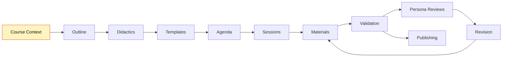

<!--
color: <span style="display:inline-block;width:1.5rem;height:1.5rem;background-color:@0;border:1px solid #ccc;border-radius:2px;vertical-align:middle;"></span> `@0`

import: https://raw.githubusercontent.com/liaScript/mermaid_template/master/README.md

@style
.dashboard {
  margin: 1.5rem 0 2rem;
  padding: 1rem;
  border: 1px solid #d7e0ea;
  border-radius: 8px;
  background: #f8fafc;
}

.dashboard-grid {
  display: flex;
  flex-wrap: wrap;
  gap: 1rem;
}

.dashboard-card {
  flex: 1 1 260px;
  min-width: 240px;
  padding: 1rem;
  border: 1px solid #d7e0ea;
  border-radius: 8px;
  background: #ffffff;
}

.dashboard-card-wide {
  flex-basis: 100%;
}

.dashboard-status {
  display: inline-block;
  padding: 0.18rem 0.5rem;
  border-radius: 999px;
  font-weight: 700;
}

.dashboard-status-done { background: #d8f5d0; color: #1b5e20; }
.dashboard-status-current { background: #fff3bf; color: #7a4d00; }
.dashboard-status-blocked { background: #ffe3e3; color: #8a1f1f; }

.dashboard table {
  width: 100%;
  border-collapse: collapse;
}

.dashboard th,
.dashboard td {
  padding: 0.35rem 0.45rem;
  border-bottom: 1px solid #e5edf5;
  text-align: left;
}

@media (max-width: 600px) {
  .dashboard-card {
    flex-basis: 100%;
    min-width: 0;
  }
}
@end
-->

# {{Course Working Title}}

## Dashboard

<article class="dashboard">

_Generated from the project sections below. Do not edit manually._

<div class="dashboard-grid">

<div class="dashboard-card">

### Current State

__Current step:__ <span class="dashboard-status dashboard-status-current">Project initialized</span>

__Course validation:__ <span class="dashboard-status dashboard-status-blocked">not run</span>

__Sessions complete:__ 0 / 0

__Last updated:__ {{YYYY-MM-DD}}

</div>

<div class="dashboard-card">

### Next Commands

1. `:init-course`
2. `:create-outline`
3. `:scaffold` (fast-track alternative)

</div>

<div class="dashboard-card">

### Quality State

<!-- data-type="none" -->
| Area | State |
| --- | --- |
| Course context | <span class="dashboard-status dashboard-status-blocked">open</span> |
| Templates | <span class="dashboard-status dashboard-status-blocked">open</span> |
| Materials | <span class="dashboard-status dashboard-status-blocked">0 / 0</span> |
| Course validation | <span class="dashboard-status dashboard-status-blocked">not run</span> |
| Persona reviews | <span class="dashboard-status dashboard-status-current">optional</span> |

</div>

<div class="dashboard-card dashboard-card-wide">

### Workflow Map



</div>

<div class="dashboard-card dashboard-card-wide">

### Session Progress

_No sessions yet._

</div>

<div class="dashboard-card">

### Open Blockers

Course Context missing — run `:init-course`.

</div>

<div class="dashboard-card">

### Quick Links

[Course Context](#course-context) · [Outline](#outline) · [Didactics](#didactics) · [Templates](#templates) · [Agenda](#agenda) · [Sessions](#sessions) · [Validation](#validation)

</div>

</div>
</article>

---

## Course Context

_Filled by `:init-course` from `templates/course-context.yaml`._

* __Course Type:__
  1. Type: {{lecture-series | self-paced | workshop | single-lesson | improve-existing}}
  2. Working Title: {{working title}}

* __Terminology:__
  1. sessions-called: {{session | unit | block | lesson | ...}}
  2. lectures-called: {{lecture | module | chapter | lesson | ...}}

* __Course Profile:__
  1. Persona type: {{professor | coach | facilitator | tutor}}
  2. Agenda required: {{yes | optional | no}}
  3. Pacing: {{scheduled | learner-driven | event-based}}
  4. Assessment defaults: {{quizzes | reflection | assignments | none}}

* __Conventions & Standards:__
  1. Language: {{de | en | other}}
  2. Tone: {{formal | informal | conversational}}
  3. Person: {{Sie | Du | you}}
  4. Accessibility: {{required | optional}}

* __LiaScript conventions:__
  - {{project-specific rules; mention required templates briefly — details belong in `## Templates`}}

* __Additional Notes:__
  - {{project-specific rules, constraints, or reminders — remove if none}}

---

## Outline

_Filled by `:create-outline` from `templates/course-outline.yaml`._

* __Title:__
  {{name of the lecture or course}}

* __Target Audience:__
  {{who is this course for? prior knowledge, age group, equipment}}

* __Time Commitment:__
  {{estimated commitment, e.g. hours per week or total hours}}

* __Abstract:__
  {{detailed abstract with all topics, benefits, and application}}

* __Learning Objectives:__
  1. {{clear learning objective with application scenario}}
  2. {{clear learning objective with application scenario}}
  3. {{clear learning objective with application scenario}}

---

## Didactics

_Filled by `:create-didactics` from `templates/course-didactics.yaml`._

* __Didactic Concept:__
  {{teaching methods, learning phases, didactic considerations — e.g. lesson rhythm, scaffolding, error culture}}

* __Professor Persona:__
  {{name, background, expertise, and role of the instructor persona}}

* __Teaching Style:__
  {{e.g. humorous, academic, practical, conversational — and how it shows in the material}}

* __Course Type:__
  {{introductory, advanced, practice-oriented, group work, self-learning}}

* __Difficulty Level:__
  {{beginner | intermediate | advanced}}

* __Persona Voice Sample:__
  {{3–5 sentences written in the exact voice of the persona, explaining a core course concept — anchors tone for all co-authoring}}

---

## Visual Identity

_Filled by `:create-visuals` (optional) from `templates/visuals.yaml`._

* __Logo Generation Guidelines:__
  1. Style: {{...}}
  2. Format: {{...}}
  3. Elements: {{...}}
  4. Mood: {{...}}

* __Logo Color Palette:__
  1. Primary: @color(#000000) — {{name}}
  2. Secondary: @color(#000000) — {{name}}
  3. Accent: @color(#000000) — {{name}}
  4. Background: @color(#FFFFFF) — {{name}}

* __Course Image Generation Guidelines:__
  1. Style: {{...}}
  2. Color scheme: {{...}}
  3. Composition: {{...}}
  4. Mood: {{...}}
  5. In-image text language: {{...}}

* __Image Consistency Rules:__
  - {{palette, character design, backgrounds, fonts}}

* __Website Color Palette:__
  1. Primary: @color(#000000) — {{usage}}
  2. Accent: @color(#000000) — {{usage}}
  3. Text: @color(#000000) — {{usage}}
  4. Background: @color(#FFFFFF) — {{usage}}
  5. Surface: @color(#FFFFFF) — {{usage}}

* __Example Prompts:__
  1. Logo: "{{full image-generation prompt}}"

---

## Templates

_Managed by `:manage-templates` from `templates/course-templates.yaml`._

LiaScript templates used by this project are imported in the main metadata header at the top of `journal.md` and should also be imported in any standalone material file that uses their macros.

More community templates can be found at [topics/liascript-template](https://github.com/topics/liascript-template). When a useful template is selected, add its `import:` line to the project header, document it here, and use the same import in materials that need the template.

### {{template-name}}

* __Import:__
  `{{raw README URL}}`

* __Header entry:__
  `import: {{raw README URL}}`

* __Purpose:__
  {{what the template enables and why this project needs it}}

* __Use when:__
  1. {{situation}}
  2. {{situation}}

* __Basic example:__

  ```text
  {{minimal working example}}
  ```

* __How to use:__
  1. {{step}}
  2. {{step}}

* __Special usage notes:__
  1. {{caveats, e.g. unique canvas ids, macro variants}}

---

## Agenda

_Filled by `:create-agenda` from `templates/course-agenda.yaml` (skip if the course profile says agenda: no)._

* __Overview:__
  {{number of sessions, duration, pacing, platform — 2–4 sentences}}

* __Modules / Sessions:__

  | # | Title | Type | Duration | Learning Objective | Material |
  |---|-------|------|----------|--------------------|----------|
  | 1 | {{title}} | {{lecture | exercise | ...}} | {{duration}} | {{objective}} | materials/1-{{type}}.md |

---

## Sessions

_Managed by `:create-session`, `:promote-session`, `:coauthor-materials`, and `:validate-course`. Overview table first, then one `### {n}. {title}` subsection per session._

| # | Title | Type | Skeleton | Material | Done | Notes |
|---|-------|------|----------|----------|------|-------|

<!-- One subsection per session, structured like this:

### {{n}}. {{Session Title}}

**Type:** {{lecture | exercise | ...}}

**Summary:**

{{2–4 sentences: focus, didactic intent, known stumbling blocks}}

**Content:**

{{topic list / content skeleton per templates/session-skeleton.yaml}}

**Activities:**

1. {{activity}}

**References:**

1. {{reference}}

After :validate-course in session mode, a `#### Validation Report` block is
inserted at the top of the subsection. After :review-as-persona, a
`#### Persona Reviews` block is appended.
-->

---

## Agents

_Agent-specific project customizations and learner personas._
_Read-scope rule: Coauthor and specialist agents are direct `###` subsections; each agent reads only its assigned subsection._

### Coauthor

* __Customization Status:__ inactive
* __Role / Persona:__
  none
* __Behavior Additions:__
  1. none
* __Preferred Interaction Style:__
  none
* __Project-Specific Rules:__
  1. none
* __Persona Voice Sample:__
  none
* __Boundaries / Never:__
  1. Do not override base workflow, validation, safety, or epistemic rules.

### Teaching-Agent

* __Customization Status:__ inactive
* __Behavior Additions:__
  1. none
* __Preferred Interaction Style:__
  none
* __Project-Specific Rules:__
  1. none
* __Boundaries / Never:__
  1. Do not override base workflow, validation, safety, or epistemic rules.

### Artist-Agent

* __Customization Status:__ inactive
* __Behavior Additions:__
  1. none
* __Preferred Visual Priorities:__
  none
* __Project-Specific Rules:__
  1. none
* __Boundaries / Never:__
  1. Do not override base visual consistency, accessibility, or uncertainty rules.

### Development-Agent

* __Customization Status:__ inactive
* __Behavior Additions:__
  1. none
* __Preferred Publishing Workflow:__
  none
* __Project-Specific Rules:__
  1. none
* __Boundaries / Never:__
  1. Do not override validation gates, git safety, or publishing checks.

### Learner Personas

_Optional — filled by `:create-learner-persona`. One `#### Persona: {icon} {name}` subsection per persona (structure defined in `tasks/create-learner-persona.md`)._

---

## Validation

_Replaced by `:validate-course` (course mode). The `### Latest Validation Summary` below is the authoritative publishing gate — publishing requires `Mode: course` and `Result: PASS`. Per-session reports live in `## Sessions` → `#### Validation Report`, not here._

### Latest Validation Summary

_Not yet run — run `:validate-course`. Format defined in `tasks/validate-course.md`, course mode step 9 (Date, Mode, Course type, Result, findings, recommended actions)._

---

## Analysis Status

_Only used for improve-existing courses — filled by `:analyze-existing`._

---

## Notes Backup

_Appended to by `:save-notes` and `:save-decision` from `templates/note-backup.yaml`._
_Each note is one append-only `### {Type}: {Descriptive Title} ({YYYY-MM-DD})` subsection._
